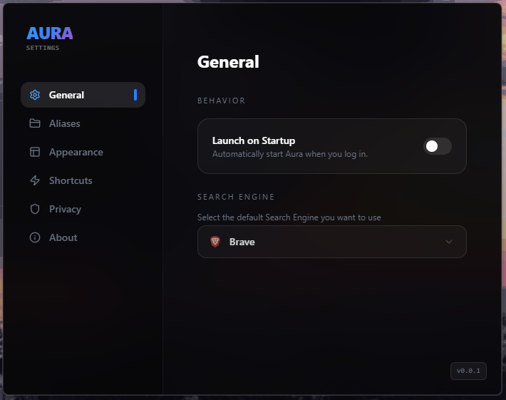

<p align="center">
  
</p>

<h1 align="center">🌌 Aura</h1>

<p align="center">
  <strong>The minimalist, lightning-fast command palette for your desktop.</strong>
  <br />
  Built with Tauri, React, and Framer Motion for a native feel with web-speed flexibility.
</p>

<p align="center">
  <a href="https://opensource.org/licenses/MIT"></a>
  <a href="https://github.com/maxi-schaefer/Aura/stargazers"></a>
</p>

---

## 📸 Overview

<p align="center">
  
  <br />
  <em>Refined interface. Zero friction.</em>
</p>

---

## 🚀 Key Features

Aura is designed to be your digital Swiss Army knife, keeping your workflow centered in one place.

| Feature | Description |
| :--- | :--- |
| **🚀 App Launcher** | Index and launch local applications instantly. |
| **🧮 Smart Calc** | Perform math and conversions directly in the search bar. |
| **🎨 Color Lab** | Live hex code previewing and clipboard copying. |
| **🌐 Aliases** | Map custom keywords to URLs for instant navigation. |
| **⚡ Native Power** | Built on Tauri for minimal RAM usage and high performance. |

---

## 🛠️ Installation

Aura is currently in active development. You can run it locally with the following steps:

### Prerequisites
- [Node.js](https://nodejs.org/) (LTS recommended)
- [Rust & Cargo](https://www.rust-lang.org/tools/install)
- [Tauri Prerequisites](https://tauri.app/v1/guides/getting-started/prerequisites)

### Quick Start
```bash
# 1. Clone the workspace
git clone [https://github.com/maxi-schaefer/Aura.git](https://github.com/maxi-schaefer/Aura.git)
cd Aura

# 2. Install dependencies
npm install

# 3. Launch in Development mode
npm run tauri dev
```

**Note:** Binary releases for macOS, Windows, and Linux are coming soon!

## 🔧 Configuration
Aura is highly extensible. You can define custom aliases and system behavior in the settings panel to match your specific dev workflow.

<p align="center">
  
</p>

## 🤝 Contributing
We love contributors! Whether it's a new command, a bug fix, or a CSS tweak, feel free to jump in.

1. Fork the repository.
2. Branch: `git checkout -b feat/your-feature-name`.
3. Commit: `git commit -m 'Add some feature'`.
4. Push: `git push origin feat/your-feature-name`.
5. Open a Pull Request.

---

<p align="center">
  Built with ❤️ by <a href="https://github.com/maxi-schaefer">Maxi Schaefer</a>
</p>