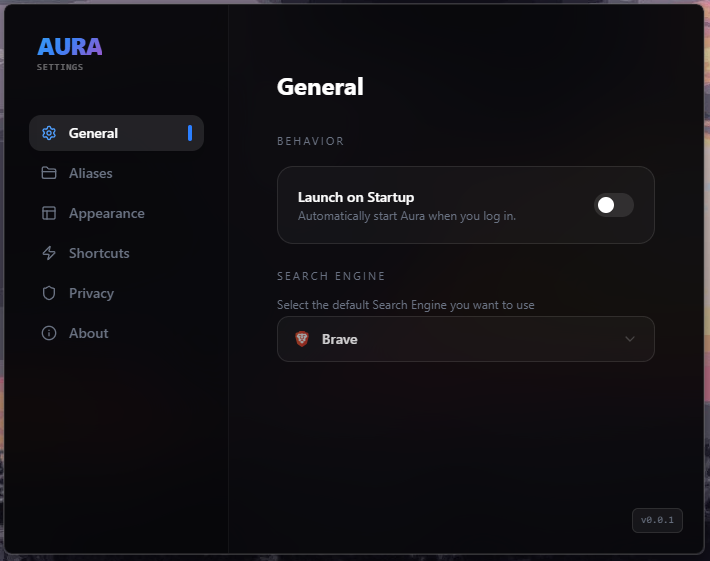

<p align="center">
  
</p>

<h1 align="center">🌌 Aura</h1>

<p align="center">
  <strong>The minimalist, lightning-fast command palette for your desktop.</strong><br>
  Experience native performance with the flexibility of the web—built with Tauri, React, and Framer Motion.
</p>

<p align="center">
  <a href="https://opensource.org/licenses/MIT"></a>
  <a href="https://github.com/maxi-schaefer/Aura/stargazers"></a>
</p>

---

## 📸 Overview

<p align="center">
  
  <br>
  <em>Sleek design. Lightning-fast results. Zero friction.</em>
</p>

Aura keeps your workflow centered in one place—launch apps, calculate, copy colors, and navigate the web without leaving your keyboard.

---

## 🚀 Features

| Feature | Description |
| :--- | :--- |
| **🚀 App Launcher** | Instantly index and launch your local applications. |
| **🧮 Smart Calculator** | Perform math operations and unit conversions directly in the search bar. |
| **🎨 Color Lab** | Preview hex codes live and copy them to your clipboard in a click. |
| **🌐 URL Aliases** | Map custom keywords to your favorite URLs for instant navigation. |
| **⚡ Native Performance** | Lightweight Tauri core ensures minimal RAM usage and native speed. |

---

## 🛠️ Installation

Aura is actively under development, but you can try it locally.

### Prerequisites
- [Node.js](https://nodejs.org/) (LTS recommended)  
- [Rust & Cargo](https://www.rust-lang.org/tools/install)  
- [Tauri prerequisites](https://tauri.app/v1/guides/getting-started/prerequisites)  

### Quick Start
```bash
# 1. Clone the repository
git clone https://github.com/maxi-schaefer/Aura.git
cd Aura

# 2. Install dependencies
npm install

# 3. Launch in development mode
npm run tauri dev
```
> ⚠️ Binary releases for macOS, Windows, and Linux are coming soon.

## 🔧 Configuration

Aura is fully customizable. You can define aliases, commands, and tweak system behavior in the settings panel.

<p align="center">  </p>

## 🤝 Contributing

We welcome all contributions! Whether it’s a new feature, a bug fix, or a style tweak, your help makes Aura better.

1. Fork the repository
2. Create a feature branch: `git checkout -b feat/your-feature`
3. Commit your changes: `git commit -m "Added some feature"`
4. Push to your branch: `git push origin feat/your-feature`
5. Open a Pull Request

Check out [issues](https://github.com/maxi-schaefer/aura/issues) for ideas or report bugs.

## 💡 Roadmap
- Cross-platform binary releases
- Plugin system for extended functionality
- Improved search ranking and fuzzy search

<p align="center"> Built with ❤️ by <a href="https://github.com/maxi-schaefer">Maxi Schaefer</a> </p>